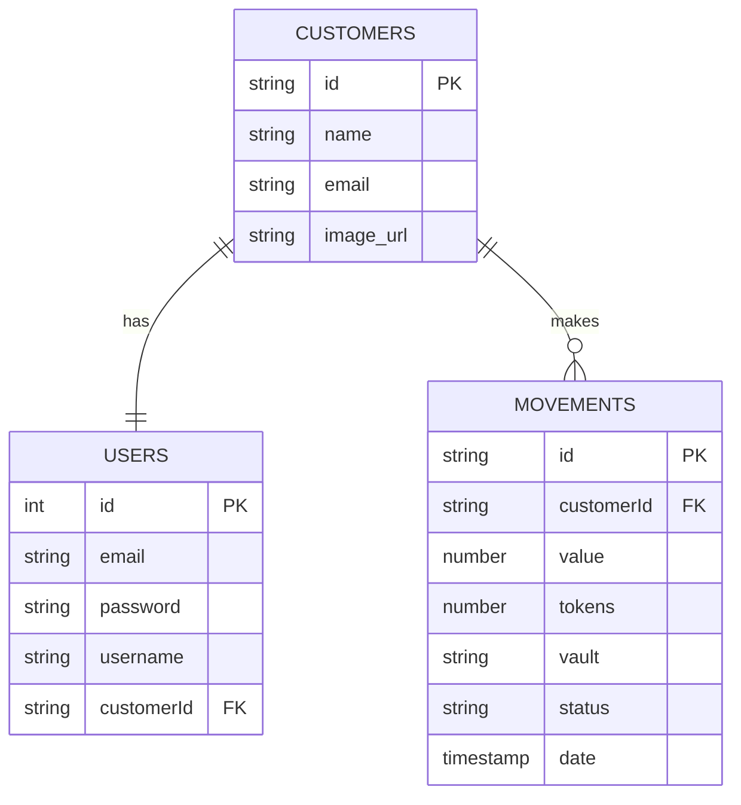

## Next.js

ERD:

```mermaid
erDiagram
    CUSTOMERS {
        string id PK
        string name
        string email
        string image_url
    }

    USERS {
        int id PK
        string email
        string password
        string username
        string customerId FK
    }

    MOVEMENTS {
        string id PK
        string customerId FK
        number value
        number tokens
        string vault
        string status
        timestamp date
    }

    CUSTOMERS ||--|| USERS : "has"
    CUSTOMERS ||--o{ MOVEMENTS : "makes"
```
